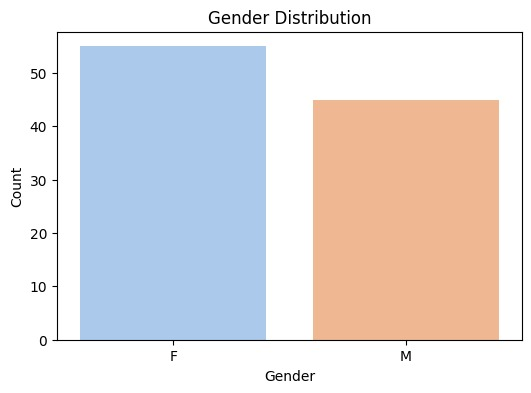
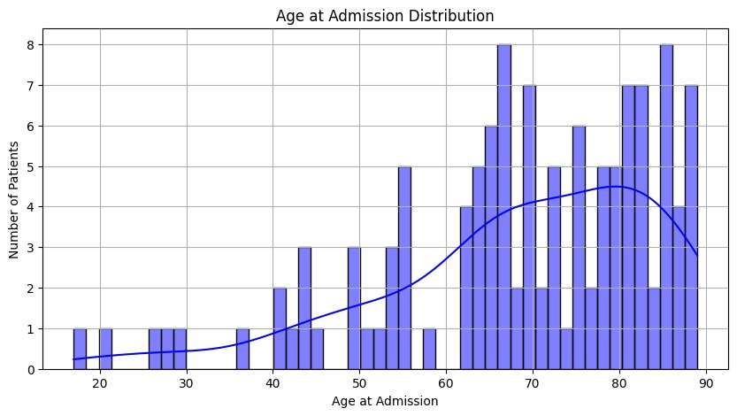
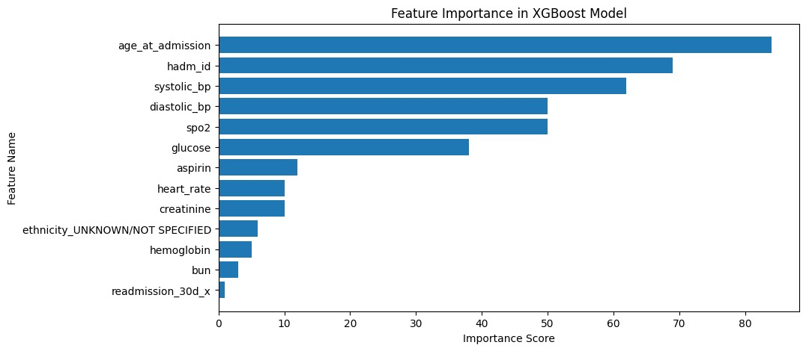
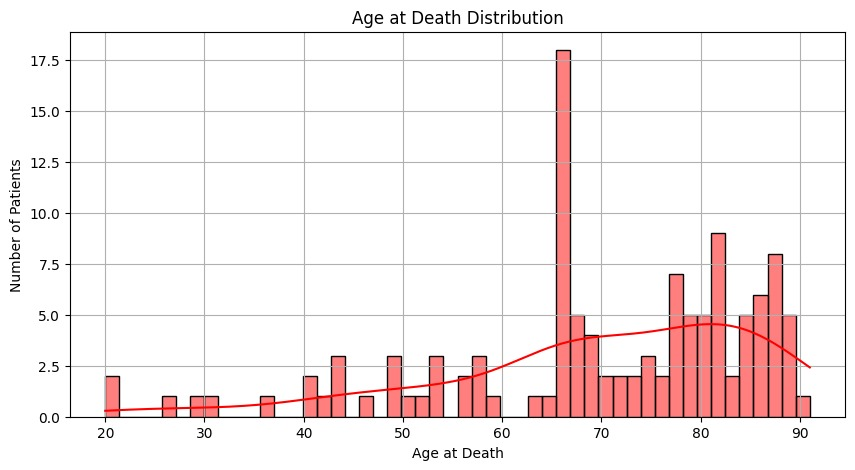
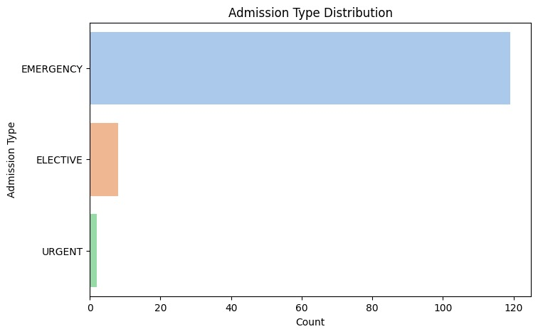
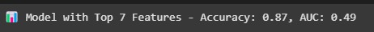
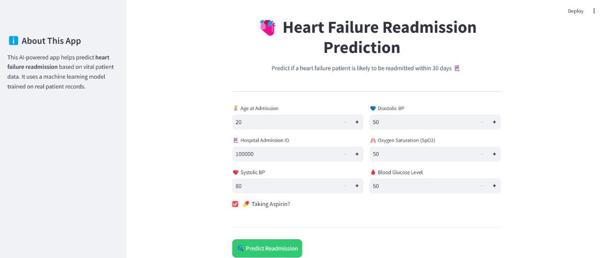

# Readmission Prediction for Heart Failure Patients (AI/ML)

## Project Overview
Heart failure is a major health concern, leading to frequent hospital readmissions. Predicting whether a patient will be readmitted within 30 days of discharge can help healthcare providers take preventive measures, reducing mortality rates and financial burdens on patients and hospitals. This project aims to develop a machine learning model using **XGBoost** for accurate readmission predictions.

## Dataset & Sources
The dataset used for this project is derived from **MIMIC-III**, a publicly available critical care database. It includes patient records, diagnoses, treatment history, and other medical parameters.

- **Diagnosis Codes (ICD-9) for Heart Failure**: ('39891', '40201', '40211', '40291', '40401', '40403', '40411', '40413', '40491', '40493', '4280', '4281', '42820', '42821', '42822', '42823', '42830', '42831', '42832', '42833', '42840', '42841', '42842', '42843', '4289')
- **MIMIC-III Table Descriptions**: [Link to documentation](https://mimic.mit.edu/docs/iii/tables/)
- **Subset of tables provided for Veersa Hackathon 2025** (OneDrive link shared by organizers)

## Data Preprocessing
Preprocessing is a crucial step in machine learning, ensuring data quality and preparing it for model training. Below are the key steps followed:

### **1. Data Loading & Exploration**
- Loaded the required MIMIC-III tables into a pandas DataFrame.





### **2. Handling Missing Values**
- Identified missing values in important features.
- Applied strategies such as **mean/median imputation**, **removal of columns with excessive missing data**, and **forward-filling for time-series data**.

### **3. Feature Engineering**
- Selected **7 dominant features** for extraction based on importance.
- Encoded categorical variables using **One-Hot Encoding** and **Label Encoding**.
- Scaled numerical features using **StandardScaler**.



### **4. Data Splitting**
- Split the dataset into **train (80%) and test (20%)** sets for model training.
- Applied **stratified sampling** to maintain class distribution.

## Data Visualizations & Insights
To better understand the dataset, we generated the following visualizations:
- **Distribution of Readmissions**
- **Correlation Heatmap of Features** (Needs to be added in the notebook)
- **Missing Value Heatmap** (Needs to be added in the notebook)
- **Boxplots for Outlier Detection** (Needs to be added in the notebook)





## Model Training
We used **XGBoost** as the primary model for predicting readmission. The model was trained using:
- Hyperparameter tuning via GridSearchCV
- Feature selection based on importance scores (The 7 selected features should be explicitly listed in the notebook)
- Performance evaluation using **Accuracy, Precision, Recall, F1-score, and ROC-AUC**

## Sample Prediction Output



## User Interface 



## Problem Statement
Heart failure is a very common ailment leading to fatalities if not attended to promptly. Even for the patients who get proper treatment, hospital readmissions result in a significant risk of death and a financial burden for patients, their families, as well as the already overburdened healthcare systems. Predicting at-risk patients for readmission allows for targeted interventions that reduce morbidity and mortality.

1. Develop a machine learning model to predict readmission of heart-failure patients within **30 days of discharge**.
2. We have provided a subset of tables at the below OneDrive link for this problem (Veersa Hackathon Submission).
3. Participants will further decide which tables they will use to solve the problem.
4. [Link to MIMIC-III table descriptions](https://mimic.mit.edu/docs/iii/tables/).
5. Before actual prediction, detailed data analysis is expected to support the model.
6. **ICD-9 Diagnosis codes for heart failure**:
   ('39891', '40201', '40211', '40291', '40401', '40403', '40411', '40413', '40491', '40493', '4280', '4281', '42820', '42821', '42822', '42823', '42830', '42831', '42832', '42833', '42840', '42841', '42842', '42843', '4289')

---

## How to Run the Application

### ** Set Up the Environment**
- Ensure you have Python 3.8 or higher installed.
-Run the following command to create a virtual environment:

```bash
python -m venv venv
```
Activate the Virtual Environment
-On macOS / Linux:
```bash
source venv/bin/activate
```
On Windows (Command Prompt):
```bash
venv\Scripts\activate
```
On Windows (PowerShell):
```bash
venv\Scripts\Activate.ps1
```
Install Dependencies
Make sure you have requirements.txt in your project folder, then run:

```bash
pip install -r requirements.txt
```
Run the Streamlit App
Once everything is set up, launch the app using:
```bash
streamlit run app.py
```
